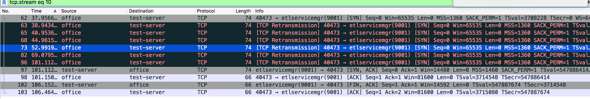

# 一个配置导致的HTTP(TCP)连接超时

这个是之前写http服务的时候测试遇到的一个问题。当时这个bug的现象是，办公室内某台安卓手机访问http服务经常出现连接超时，而过一会儿之后又可以使用了。而同时，办公室内的iOS设备，Mac设备又能正常使用服务。甚至登陆到http服务实时监控日志，会发现安卓的设备的请求确实没有到达http服务，没有access日志。

## 简单抓包

这个时候实在没法，在服务端tcpdump一下对应的http端口的请求，还好是开发环境。dump过程中，仅一分钟，安卓手机就又遇到了相同的情况。这时结束dump，下载dump出来的内容到本机用wireshark进行分析。

## 分析包内容

  

  打开包，按照时间顺序排列，看到大片的黑色记录，也就是有大量TCP重传。照说办公室到测试服务器的网络是稳定的，而且是在服务器上面抓的包。所以不应该存在大量的重传才对。所以先从这里着手。trace一下出现重传的tcp stream。其中编号为10的tcp流很有意思：

  

  可以看到，office在37s的时候发送了一个syn包进行握手，之后进行了六次重传，直到第101s的时候，server才响应了一个syn，ack，但是此时客户端可能已经超时，所以返回了ack完成三次握手之后，什么都没做，五秒之后，服务器发了FIN包，断开连接，而客户端也只回复了ACK，没有进一步fin包。

  这个很有意思，这个是在握手的时候出现了重传，而服务器明显收到了包，但是就是没有ACK。注意这个是在服务器抓的包，所以不存在包丢了，没收到，需要客户端重传的问题。而且SYN包很小，一般不会因为出错导致整个包重传的情况。这个现象引起了我的注意。我简单谷歌了一下这个现象，果然发现很多遇到类似问题的人：

  [why would a server not send a syn ack packge ...](https://serverfault.com/questions/235965/why-would-a-server-not-send-a-syn-ack-packet-in-response-to-a-syn-packet)

  [many different tcp timestamp through nat device...](https://serverfault.com/questions/307376/many-different-tcp-timestamps-through-nat-device-cause-server-to-drop-packets-p)

  [dropping of connections with tcp-tw-recycle](https://stackoverflow.com/questions/8893888/dropping-of-connections-with-tcp-tw-recycle)

  综合来说，就是因为同时打开了tcp timestamp和tcp timewait recycle导致了服务器操作系统主动丢包，这里有以下几条需要注意的东西

- tcp timestamp 用于计算tcp round trip time(RTT)，RTT用于计算发送窗口等。
- tcp timestamp 完全由用户端提供，iOS的timestamp会大于Android的timestamp。
- tcp timestamp 和 tcp seq 在操作系统的网络栈中，被认为是同步递增的。如果是一个连接，这两个值同步递增才是合理的，否则认为是错误的包，会丢包（重点）。
- tcp timewait 状态用于确定tcp断开连接之后保留连接的socket，等待剩余的FIN包，以防止数据丢失。
- 服务器为了提高并发连接数，开启了 tcp-tw-reuse和tcp-tw-recycle
- tcp tw recycle 和 reuse 允许操作系统复用处在timewait状态的socket，达到提高并发连接数的目的。但是两个选项有差别，看后面的补充。
- NAT 设备 可能让到达同一个目的地的不同请求，使用同一个端口进行通信。（可能）

由于开启了 tw recycle，所以出现了同一个socket在FIN之后还可以重新连接的情况，而这个时候timestamp和seq还没有重置，seq变大了，安卓的timestamp却变小了，导致了操作系统主动丢包，http应用看不到日志就很正常了，因为他根本没有被投递到上层嘛。

## 修复方法

关闭 tcp-tw-recycle 。

## 补充

注意，还有另外一个socket复用的方法，那就是 tcp-tw-reuse。这个是安全的。仍旧可以使用复用socket达到提高连接数的目的。

```
   tcp_tw_recycle (Boolean; default: disabled; since Linux 2.4)
          Enable fast recycling of TIME_WAIT sockets.  Enabling this
          option is not recommended for devices communicating with the
          general Internet or using NAT (Network Address Translation).
          Since some NAT gateways pass through IP timestamp values, one
          IP can appear to have non-increasing timestamps.  See RFC 1323
          (PAWS), RFC 6191.
```


 
