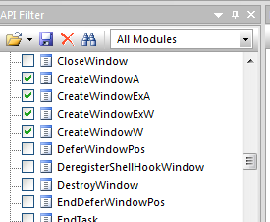
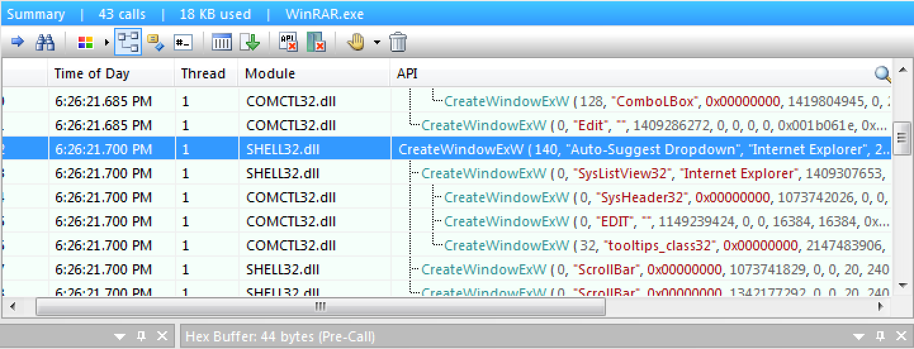
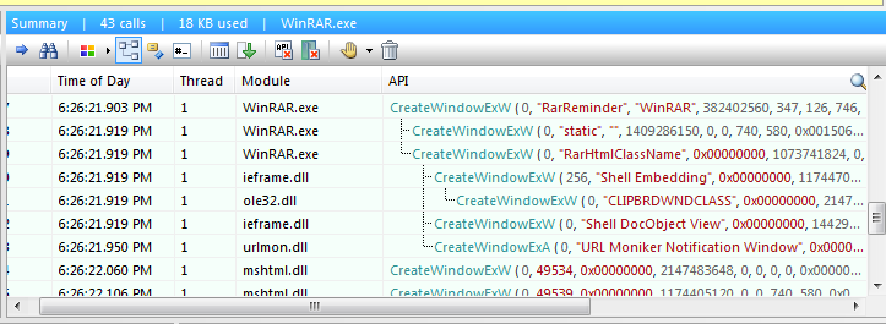
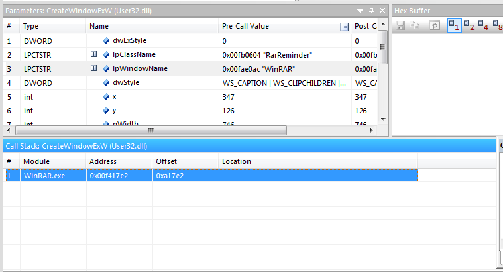
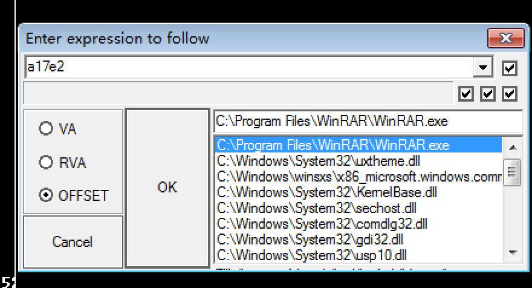
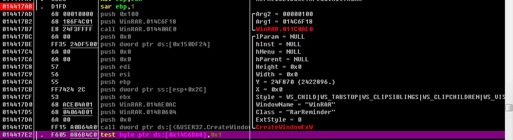
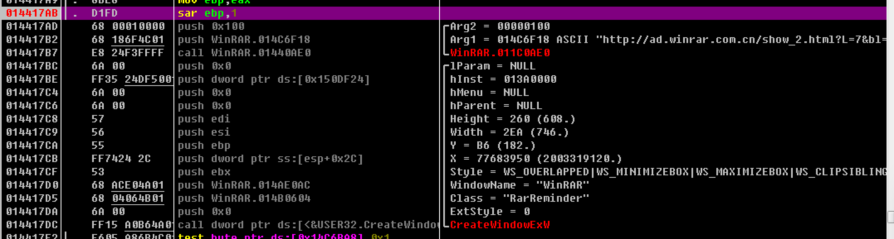
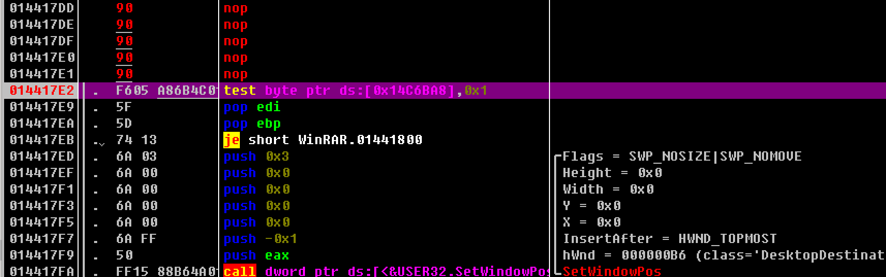

# winrar去广告

本帖纯属技术交流，请支持正版。

## 获取winrar
直接从百度搜索winrar，然后装一个即可。我的操作系统是win7，其他环境下可能有些不同。自己去折腾。

## 正常的winrar

由于没有购买winrar，所以打开是存在广告的。所以就想尝试能不能试着用逆向将广告抹掉。

## 追踪API调用

很明显，这里创建了窗口，那么很有可能调用了CreateWindows相关的API。我用API monitor进行追踪，打开以下API监控：
 

然后开始进行追踪。追踪结果中，有两个疑似是广告窗口的创建调用：

第一个创建的是"auto-suggest dropdown"，还有跟IE相关，因为广告窗口会需要浏览器，所以怀疑是不是这个。第二个创建的是"reminder"，这个很像那种过期提醒。所以同样怀疑下。

这里实际分析之后发现其实第一个调用处不是构建那个广告窗口的地方，所以跳过不理。我们看第二个调用处的调用栈。

相当简洁明了，在相对winrar.exe的代码段偏移量为0xa17e2的地方（当时的实际地址0xf417e2）调用了这个函数。这个地址。这里注意一个问题，这里只有偏移地址是有用的，实际的地址是没有用的，具体原因后面说。

## 0xa17e2的追踪。

我们用ollydbg加载winrar，然后`ctrl+g`跳转到offset为a17e2的地址：

我们看到周围的代码大概是这样的。

紫色的地方就是偏移量a17e2的地址。现在代码还没跑起来，所以是完全静态的分析结果，可以看到，这里先用两个参数，调用了winrar.11c0AE0位置的一个函数，然后就是调用CreateWindow函数调用。在这两个函数调用前面打一个断点，然后运行到这之前，代码就变成了这样：

这里可以看到，传入winrar.11c0AE0函数的参数里面，包括了一条链接。下面剩下的就是CreateWindow的调用。这里很可能就是去这个地址get到一个广告，然后渲染到这个window上来。为了让这个窗口不弹出来，我们可以尝试将这两个函数调用中间的这段地址填充成NOP，让他什么都不做。然后跳过这些NOP，到之前的0xa17e2这个地方：

这里看到，有一个test命令，这个test其实就是测试窗口创建是否成功，如果成功，继续下面的内容，否则结束函数调用。这里不做进一步分析，让程序直接继续运行，就会发现广告窗口没有弹出来了。

## 第一次保存到可执行文件
之后将修改的内存copy to binary file，并且save file。save的时候会弹窗提示如下内容：

![firstsave] (firstsave.png)

意思是这里有自动填充的内容，直接保存到二进制文件可能出错，是否继续？那肯定继续啊。保存为winrar2.exe。然后我们执行winrar2.exe就会发现。。。。崩溃了。嗯，崩溃了。

## 分析修改后的二进制文件

将winrar2.exe加载到ollydbg里面，仍旧跳转到0xa17e2这个地址。

