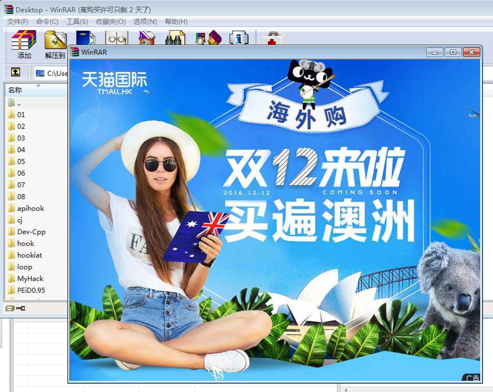

# winrar去广告

本帖纯属技术交流，请支持正版。

## 获取winrar
直接从百度搜索winrar，然后装一个即可。我的操作系统是win7，其他环境下可能有些不同。自己去折腾。

## 正常的winrar

由于没有购买winrar，所以打开是存在广告的。所以就想尝试能不能试着用逆向将广告抹掉。

## 追踪API调用

很明显，这里创建了窗口，那么很有可能调用了CreateWindows相关的API。我用API monitor进行追踪，打开以下API监控：
 

